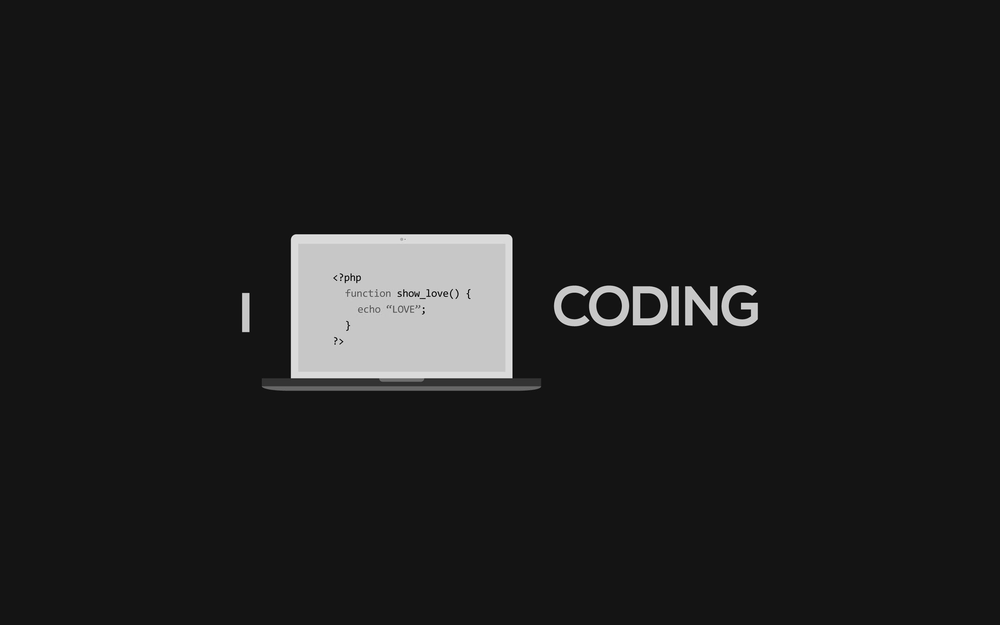

<h1>
  Estudios del lenguaje PHP
</h1>

<h3>
  Este repositorio contiene estudios del el lenguaje de PHP. se trabajan distintas fuentes tanto escritas como audio visuales.
</h3>

  Referencias

<ul>
  <li>
    <a href="https://stackify.com/learn-php-tutorials/ " target="_blank">
      Stackify
    </a>
  </li>
  <li>
    <a href="https://kinsta.com/blog/php-tutorials/" target="_blank">
      kinsta
    </a>
  </li>
  <li>
    <a href="https://www.w3spoint.com/php-tutorial" target="_blank">
      w3spoint
    </a>
  </li>
  <li>
    <a href="https://www.javatpoint.com/php-tutorial" target="_blank">
      javatpoint
    </a>
  </li>
  <li>
    <a href="https://www.phptutorial.net/ " target="_blank">
      phptutorial
    </a>
  </li>
  <li>
    <a href="https://www.tutorialspoint.com/php/index.htm" target="_blank">
      tutorialspoint
    </a>
  </li>
  <li>
    <a href="https://www.w3schools.com/php/ " target="_blank">
      w3schools
    </a>
  </li>
  <li>
    <a href="https://www.tutorialesprogramacionya.com/phpya/?inicio=0" target="_blank">
      tutorialesprogramacionya
    </a>
  </li>
</ul>
<!-- -------
##### Referencias audiovisuales 

- [xxxxxxxxx](https://www.youtube.com/playlist?list=PLCTD_CpMeEKQhRiJx7Wv3pM3rYvT9_CS9)
- [xxxxxxxxx](https://www.youtube.com/playlist?list=PLU8oAlHdN5BkinrODGXToK9oPAlnJxmW_)
- [xxxxxxxxx](https://www.youtube.com/playlist?list=PLjwdMgw5TTLVDv-ceONHM_C19dPW1MAMD)
- [xxxxxxxxx](https://www.youtube.com/playlist?list=PLvRPaExkZHFkpBXXCsL2cn9ORTTcPq4d7)
- [xxxxxxxxx](https://www.youtube.com/playlist?list=PLoNyKJJ130VFn5lO2HCvfUyteP14mSxZx)
- [xxxxxxxxx](https://www.youtube.com/playlist?list=PLH_tVOsiVGzmn89QxjFTCE19rLSDqG03U)
- [xxxxxxxxx](https://www.youtube.com/playlist?list=PL3b9xmg86NTIy18iJLav8oGyA3c__lw0S)
- [xxxxxxxxx](https://www.youtube.com/playlist?list=PLCTD_CpMeEKQhRiJx7Wv3pM3rYvT9_CS9) -->
